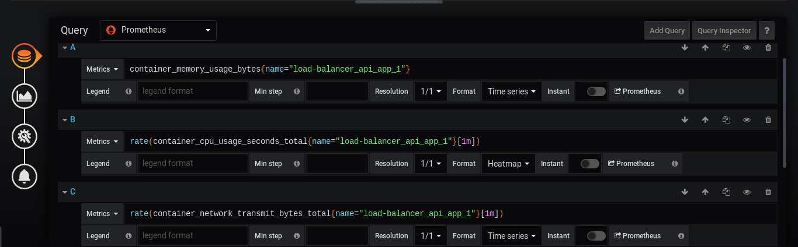
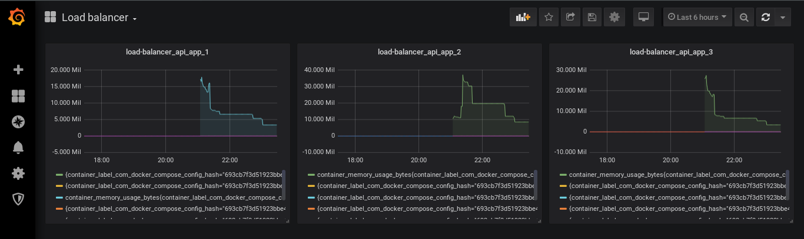

# Load Balancer on NGINX

## Setup
- Install docker and docker-compose
- Clone repository
- Run: `docker-compose up --scale api_app=3`

## Example prometheus queries:
- `container_network_receive_bytes_total{name="load-balancer_api_app_1"}`
- `container_cpu_usage_seconds_total{name="load-balancer_api_app_1"}`
- `container_memory_usage_bytes{name="load-balancer_api_app_1"}`

## Grafana configuration:
- Login on http://localhost:3000 with admin/pass credentials
- Click on "Add data source"
- Select "Prometheus"
- In the url field enter: `http://prometheus:9090`
- Click "Save & test"
- Add new panel with some dashboards 

